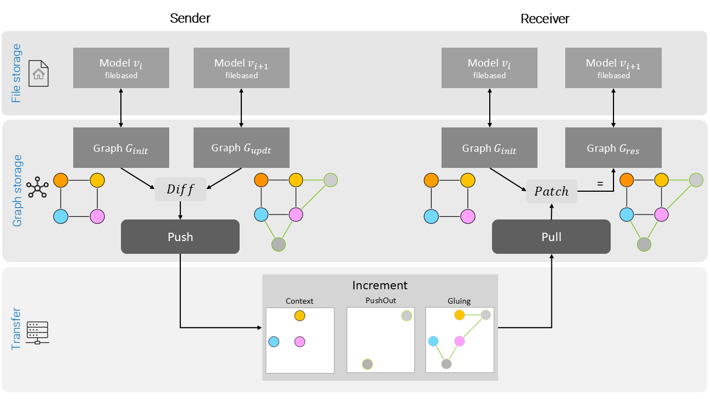

# ConMan2: Version Manager for BIM models

SPDX-License-Identifier: MIT


https://github.com/user-attachments/assets/cbe32cb9-8c09-4314-855f-b8cbd3bbfe47


## Problem statement 

BIM and Digital Twin workflows currently depend largely on loosely connected, monolithic files specific to certain disciplines. 
These discipline models are manually coordinated and form the atomic unit disseminated within a project. 
This collaborative strategy presents considerable difficulties in recognizing model changes and performing subsequent actions because incremental information is not readily accessible and must be manually determined by each project stakeholder. 
We introduce a graph-based version management system where BIM data are represented as Labeled Property Graphs within a Neo4j database, allowing for the decoupling of synchronization from proprietary formats. 
By identifying unchanged sections of the model based on the graph representation of each version, incremental changes between different model states can be derived. 
Following this, topological changes and attribute alterations are determined and packed into accurate version increments. 
These version increments are shared through a collaboration hub, which enhances the traditional functions of Common Data Environments. 
Additional functionalities include support for branching and merging, enabling the integration of different model versions into coherent states. 
In conclusion, this version control framework plays a crucial role in advancing the maturity of BIM Level 3 collaboration, ensuring the integrity of the project lifecycle from start to finish.

This repository contains the prototypical implementation of the aforementioned version control system for BIM models, mainly based on the [IFC](https://technical.buildingsmart.org/standards/ifc/) standard.



We have published several papers detailing this approach:

```bibtex
@article{Esser2022,
   author = {Sebastian Esser and Simon Vilgertshofer and André Borrmann},
   doi = {10.1016/j.aei.2022.101664},
   journal = {Advanced Engineering Informatics},
   month = {8},
   pages = {101664},
   title = {Graph-based version control for asynchronous {BIM} collaboration},
   volume = {53},
   year = {2022},
}
```

and

```bibtex
@article{Esser2023,
   author = {Sebastian Esser and Simon Vilgertshofer and André Borrmann},
   doi = {10.1016/j.autcon.2023.105063},
   journal = {Automation in Construction},
   month = {11},
   pages = {105063},
   title = {Version control for asynchronous {BIM} collaboration: Model merging through graph analysis and transformation},
   volume = {155},
   year = {2023},
}
```

When utilizing this repository in your work, please cite the respective papers. 

## Installation and Setup

### Forking the Repo

Start with creating a fork of this repository by clicking the fork symbol in the upper right corner. 
You will be asked to specify the target hub (normally, only your personal space can be chosen).
Once forking is done, run `git clone` to download the repo on your machine.

### Installation and Preliminary Settings

Once the repository is cloned, navigate to `<...>/conman2/src/`. This is the base directory of the application.

The codebase acts as an intermediate server between an end-user and a running graph database. 
The system was primarily implemented with neo4j, but is experimentally extended to networkx. 

#### Neo4j 

You can either use a local installation of neo4j or you create an instance on Neo4j Aura. 

##### Local Installation
Download and install the following products on your machine before continuing: 

 - Download and install the latest version of [neo4j Desktop](https://neo4j.com/download-v2/).
   You can test its successful installation by creating and starting a new database instance. 

 - The DB browser of running neo4j instances is accessible port 7474 (http). 

Default credentials: 
| var   | value      |
| ----- |:----------:|
| user  | `neo4j`    |
| pw    | `password` |

##### Neo4j Aura

Create a Neo4j Aura instance at https://console.neo4j.io/. 
Download the credentials file, rename it from `*.txt` to `*.env`, and place it in the `src/` folder.
The connector reads `src/*.env` to connect to your Aura instance; if no `*.env` is present, it falls back to `localhost:7687`.

- OPTIONAL: Download and install [Anaconda](https://www.anaconda.com/products/individual) or create a virtual environment.

- Install the Python requirements using: `pip install -r requirements.txt`.

### NetworkX support

NetworkX support has been recently added and is under development.  

To use NetworkX instead of Neo4j, set the `graph_provider` parameter in the constructor of the IfcGraphInterface class. 
If not specified, the system tries to connect to neo4j (as described before). 

## The ConMan2 CLI

All core features are accessible via the ConMan2 CLI (Consistency Manager).

To get started:

- Open a new terminal.
- Activate your Python virtual environment (`venv/scripts/activate.bat`, `.\venv\Scripts\Activate.ps1`, or equivalent).
- Navigate to the `src` directory: `cd src`.
- View available commands with: `python conman2.py -h`.
- For details on a specific command, use: `python conman2.py <COMMAND> -h` (e.g., `python conman2.py commit -h`).

Additional usage examples can be found in the `src/terminal_prep` directory.

## Translating IFC Models from/to Graphs

Besides the CLI application, various functions can be accessed directly via Python scripts.  
A good getting started sample is the `script_parseIfc2Graph.py` script, which imports an IFC model into the graph database.  
This script contains all required settings and method calls.  
Ensure you specify the correct path to the IFC model(s) you wish to parse into the database.

A graph representation of an IFC model can be parsed back into an SPF-based representation using the python script `script_parseGraph2Ifc.py`.

## Caveats Concerning Edge Case IFC Classes
The IFC schema includes cases where the general translation of entities, relations, and attributes does not work. One of these cases is the attribute _TrueNorth_,  which the IFC class _IfcGeometricRepresentationSubContext_ derives from its parent class _IfcGeometricRepresentationContext_. It is therefore, ignored [here](https://gitlab.lrz.de/sebastian.esser/conman2/-/blob/7086b80518b6f310adba0fe5fa6154ca92cf30de/src/ifc_graph_interface/IfcGraphInterface.py#L199). If similar cases arise, add the respective key name to the check there.

## Python Packages and Dependencies
| Package         | Github URL           | License |
| --------------- |:-------------:| ------- |
|[IfcOpenShell](http://ifcopenshell.org/)| https://github.com/IfcOpenShell/IfcOpenShell |LGPL-3.0, see `third_party_licenses/lgpl-3.0.txt` for further details |
|[Neomodel](https://neomodel.readthedocs.io/)| https://github.com/neo4j-contrib/neomodel | MIT,  see `third_party_licenses/neomodel-mit.txt` for further details |
| [Python-dotenv](https://github.com/theskumar/python-dotenv) | https://github.com/theskumar/python-dotenv | BSD-3 | 
| [NetworkX](https://github.com/networkx/networkx) | https://github.com/networkx/networkx | BSD-3, see `third_party_licenses/bsd3-networkX.txt` for further details |
